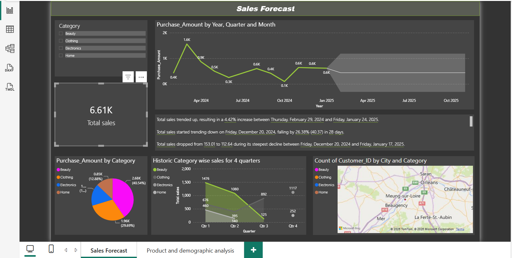

# Comprehensive Sales Performance Analytics & Predictive Pipeline

## Project Overview
This end-to-end Business Intelligence and Data Operations project transforms raw transactional datasets into interactive, executive-ready analytical pipelines. Designed to bridge the gap between data engineering and business strategy, the ecosystem delivers deep-dive consumer diagnostic capabilities alongside predictive modeling to optimize inventory and marketing capital deployment.

### Key Business & Analytical Solutions:
* **Predictive Capital Planning:** Built predictive time-series modeling to project sales trends and map confidence intervals over future cycles.
* **Statistical Anomaly Diagnostics:** Engineered a custom Python pipeline within the ETL process using statistical data diagnostics to isolate and flag transactional anomalies and data outliers.
* **Demographic Cluster Profiling:** Structured customer segmentations across continuous age groups and historical purchasing variables to isolate key driver demographics.

## Interactive Dashboards

### 1. Predictive Sales Forecasting Pipeline
*Focuses on advanced time-series modeling, transactional frequency tracking, and regional categorical distributions.*



### 2. Product & Consumer Demographic Analysis
*Focuses on cohort segmentation, product performance vectors, and statistical outlier bounding.*


---

## Key Insights

- **Top Performing product Categories**: Products from Beauty Catgeory had the highest revenue.
- **Sales Trends**: Total sales trended up, resulting in a 4.42% increase between Thursday, February 29, 2024 and Friday, January 24, 2025.
- **Customer Segmentation**: Majority of sales from returning customers. Most of the sales from customers in the age of late 30's

## Core Data Pipeline Features & Insights

* **Time-Series Forecasting & Velocity Tracking:** Successfully modeled macro sales trends, capturing a **4.42% structural increase** across cycles while mapping steep decline variances (such as a 26.38% operational contraction within a 28-day window) to isolate performance bottlenecks.
* **Demographic Matrix Mapping:** Discovered high-value age clusters, evaluating total sales across continuous age fields ($18 \text{ to } 60$) which revealed core revenue concentrations within mid-to-late 30s demographic vectors.
* **Customer Retention Diagnostics:** Structured performance comparison metrics isolating transaction volumes between new and repeat customers, revealing that returning customer cohorts anchor the core baseline revenue matrix ($6.5\text{M}$ vs $6.3\text{M}$).
* **Categorical Distribution:** Isolated the Beauty category as the primary enterprise revenue driver, capturing $40.54\%$ ($2.68\text{K}$) of total category-wise sales distributions.


## Visualizations
- Pie charts for catgeory wise sales
- Line charts for quarterly trends - Category wise
- Heatmaps for regional sales
- Bar Graph for sale based on age

## Technologies Used
- Power BI
- DAX for calculated measures
- Python for identifying anamolies using z score

  # #code data cleaning (python)
- To ensure maximum data integrity and prevent operational drift from skewing dashboards, a pre-processing Python script was executed to audit continuous transaction fields and eliminate extreme structural outliers using a standard score ($Z$-score) framework.

#data cleaning for Sales purchase records
  
```python
import pandas as pd
from scipy import stats

# 1. Load raw transactional dataset
df = pd.read_csv("Sales_purchase_data.csv")

# 2. Structural Inspection & Metadata Auditing
print("--- Data Structure & Schema Verification ---")
df.info()       # Evaluates data types, non-null values, and potential missing vectors
df.describe()   # Yields structural summary statistics for continuous elements

# 3. Statistical Outlier Detection Framework
# Establishing strict boundary conditions to clear data noise and anomalies
target_metric = "Purchase_Amount"

# Compute standard Z-score deviations for the primary performance column
df["z_score"] = stats.zscore(df[target_metric])

# Isolate anomalies sitting outside 3 standard deviations (+/- 3σ)
outliers = df[(df["z_score"] > 3) | (df["z_score"] < -3)]

print(f"\n--- Statistical Outliers Identified: {len(outliers)} Records ---")
print(outliers)

# 4. Export Clean Database for Power BI Deployment
clean_df = df[(df["z_score"] <= 3) & (df["z_score"] >= -3)].drop(columns=["z_score"])


**## this project is a sample and does not represent actual data of any organisation
**
**## How to Use
**Download the `.pbix` file and open it in Power BI Desktop.

**## Data Source
**- (https://www.kaggle.com/datasets/logiccraftbyhimanshi/walmart-customer-purchase-behavior-dataset)
